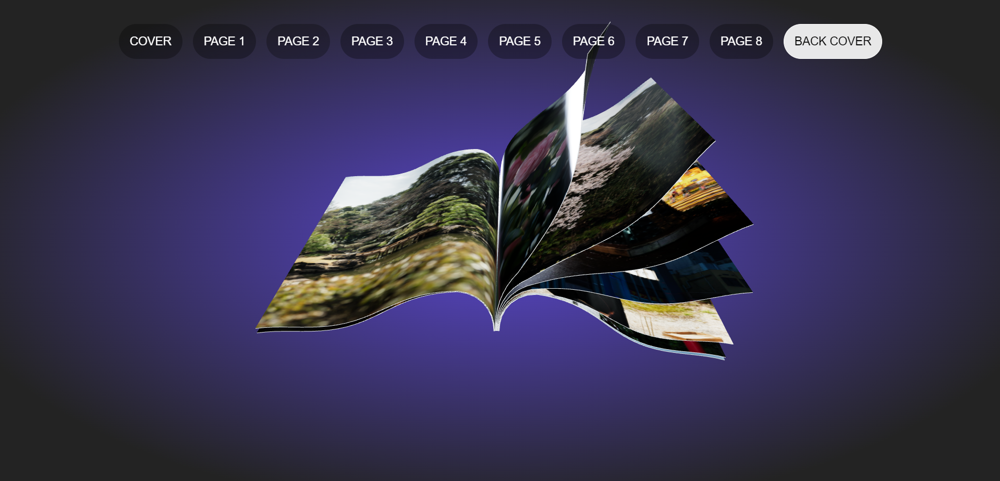

# 3D Animated Book Slider

A web application that features a 3D animated book slider using Three.js and React. Tailwind CSS is used for styling. This interactive website allows users to navigate through a book by clicking on its pages, experiencing smooth 3D animations and effects.

You can access the live demo of the 3D book slider application [here](https://three-js-book-slider.vercel.app/).




## Features

- **3D Book Animation**: A realistic 3D book with animated page turning.
- **Page Navigation**: Clickable page buttons at the top of the screen to jump to specific pages (including cover and back cover).
- **Interactive Viewing**: Rotate the book and view its sides using your cursor. Zoom in and out for a closer look.
- **Responsive Design**: Optimized for various screen sizes with the help of Tailwind CSS.


## Technologies Used:
- **Three.js**: For 3D animations and rendering.
- **React**: For building the user interface.
- **Tailwind CSS**: For styling and responsive design.

## Getting Started
Follow these instructions to get a copy of the project up and running on your local machine.

#### Prerequisites

- Node.js
- yarn

#### Installation

1. Clone the repository:
   ```bash
   git clone https://github.com/sargunkohli152/ThreeJS-Book-Slider.git
   ```
2. Navigate to project directory
   ```bash
   cd ThreeJS-Book-Slider
   ```
3. Install dependencies
    ```bash
    yarn
    ```
4. Start the development seveer
    ```bash
    yarn run dev
    ```

## Usage

- **Click on Pages:** Click on any page of the book to turn to the next or previous page.
- **Page Buttons:** Use the buttons at the top to directly open a specific page.
- **Interactive Controls:** Move your cursor to rotate the book and view its sides. Use the scroll wheel to zoom in and out.

## Contributing

Thank you for considering contributing to the Media Upload Backend! Contributions help improve the project and make it better for everyone.

To contribute, follow these steps:

1. Fork the repository.
2. Create a new branch for your feature or bug fix:
   ```bash
   git checkout -b feature/your-feature
   ```
   or 
    ```bash
    git checkout -b bugfix/your-bugfix
    ```
3. Make your changes, commit them, and push to your fork:
   ```bash
    git add .
    git commit -m 'Your descriptive commit message'
    git push origin feature/your-feature
   ```

4. Open a Pull Request (PR) on the original repository.
    - Provide a detailed description of your changes in the PR.
    - Reference any relevant issues or related PRs.
5. Your PR will be reviewed, and once approved, it will be merged into the main branch.

## License
This project is licensed under the MIT License.
